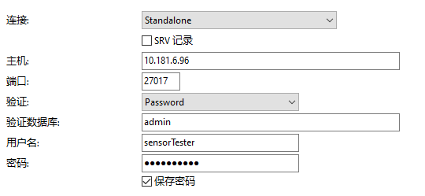
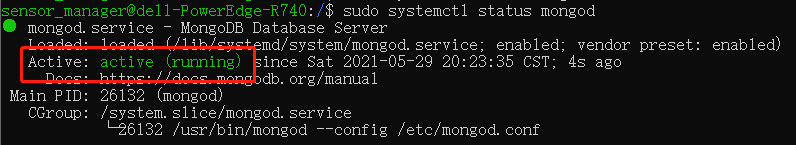
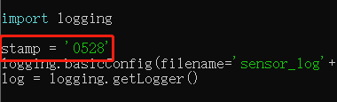
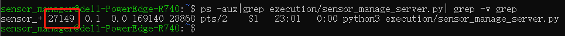

# 常用链接  
### 串口服务器调试软件
http://39.108.220.80/download/user/ZQWL/EthRS/tools/  
### pymodbus文档
https://pymodbus.readthedocs.io/en/stable/#  
### pymongo文档
https://pymongo.readthedocs.io/en/stable/index.html  
### apscheduler文档
https://apscheduler.readthedocs.io/en/stable/index.html

# python版本  
python==3.7+  
pymodbus==2.5.3  

# 用户教程  
## 数据库连接
  
密码：pingtaishiyan  

# 管理员教程  
## 停电后重启  
1. 用ssh连接服务器  
    `ssh sensor_manager@10.181.6.96`  
    密码：sensor123456  
2. 开启MongoDB  
    `sudo systemctl start mongod`  
    验证是否开启：`sudo systemctl status mongod`  
      
    **Active**状态显示 **active(running)** 就说明启动成功  
3. 修改程序标记日期  
    打开python程序：`sudo nano execution/sensor_manage_server.py`  
    修改第19行的变量stamp为重启的日期  
      
    修改后用**Ctrl+X**保存  
4. 运行python程序  
    `nohup python execution/sensor_manage_server.py &`

## 关闭程序
1. 获取进程号  
    `ps -aux|grep execution/sensor_manage_server.py| grep -v grep`  
      
2. 终止进程
    `kill -9 进程号`  

## MongoDB管理  

### mongodb安装及开启
https://docs.mongodb.com/manual/tutorial/install-mongodb-on-ubuntu/#run-mongodb-community-edition

### 用户管理
1. 建立admin用户  
    `use admin`  
    `db.createUser({user: "myUserAdmin",pwd: passwordPrompt(),roles: [{ role: "userAdminAnyDatabase", db: "admin" }, "readWriteAnyDatabase" ]})`  
2. 退出后用admin重新登陆  
    `mongo --port 27017  --authenticationDatabase "admin" -u "myUserAdmin" -p "sensor123456"`  
3. 设置manager和tester  
    `use sensor_management`  
    `db.createUser({user: "sensorManager", pwd:"manage123456", roles: [ { role: "readWrite", db: "sensor_management" }]})`  
    `db.createUser({user: "sensorTester", pwd:"test123456", roles: [{ role: "read", db: "sensor_management" }]})`  

### 修改密码
    `use admin`  
    db.changeUserPassword("sensorManager", "cpes45097")
    db.changeUserPassword("sensorTester", "pingtaishiyan")

#### 网上教程
https://www.jianshu.com/p/5a104184e010

